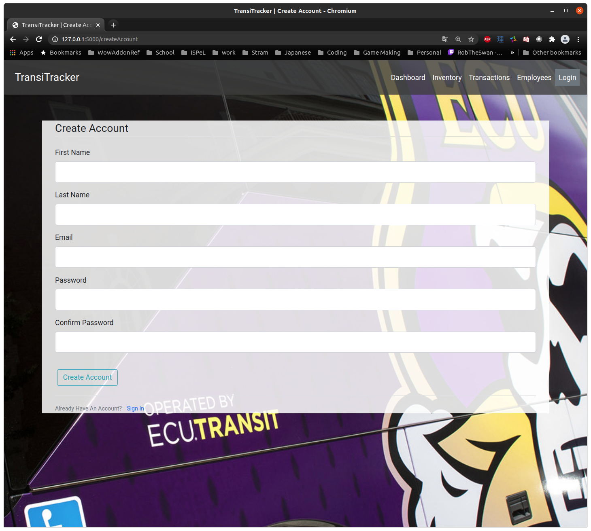
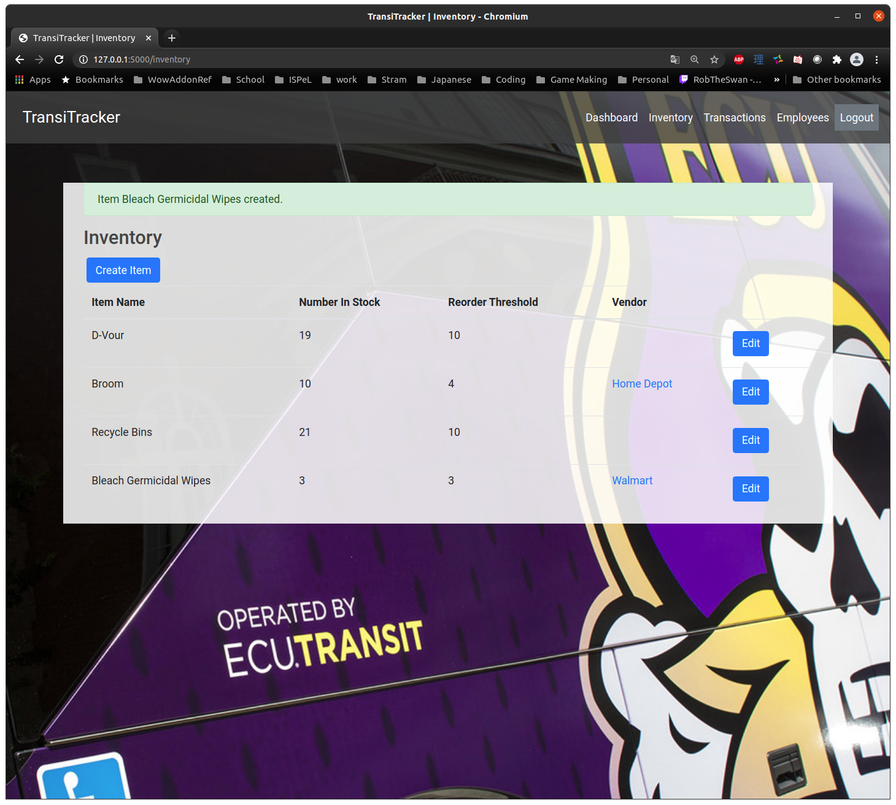
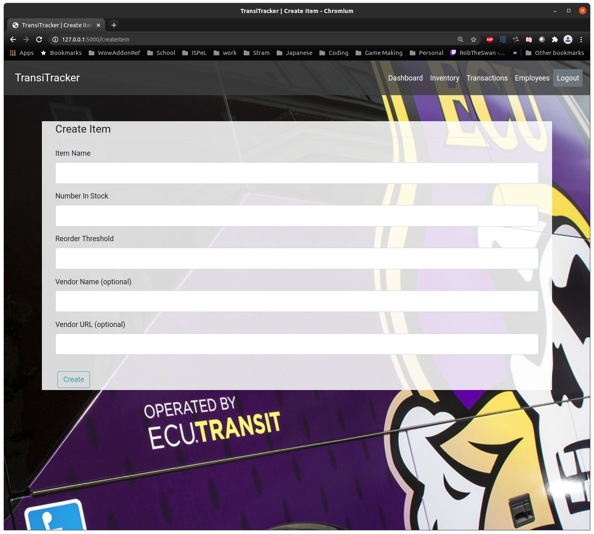
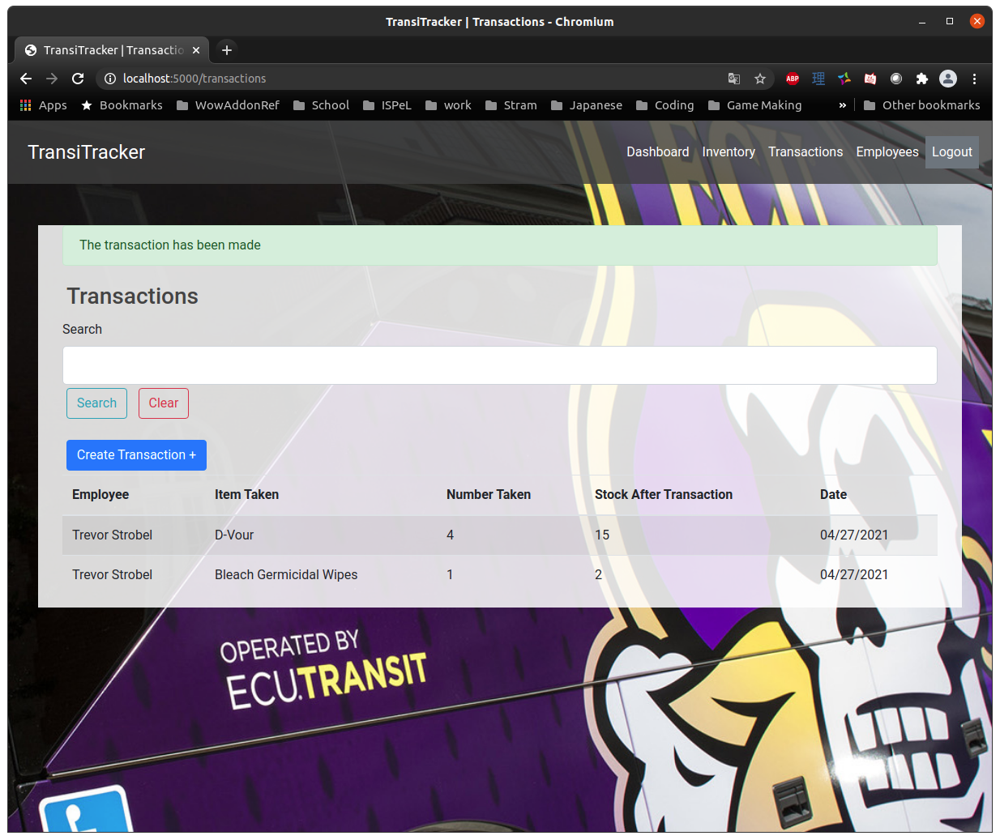
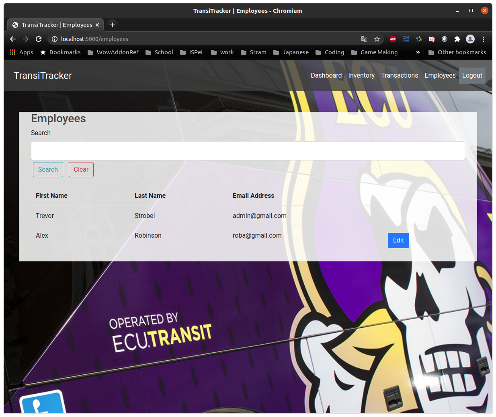
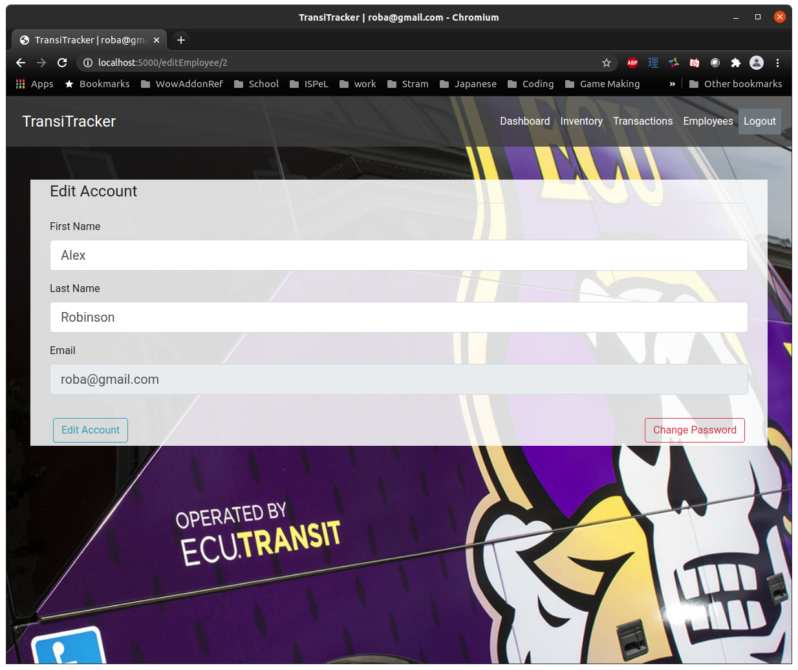

<h1>TransiTracker User Manual</h1>

---

<h2>Table of Contents </h2>
- [TransiTracker DB Creation](#transitracker-db-creation)
- [Running the Application](#running-the-application)


---
<h2>Installation</h2>


This section is meant to be read from beginnig to end. Installation steps are in an order that ensures dependencies are in place before installing a package that depends on them.  


<h3>Server set up</h3>


While any modern linux installation should work, this document will assume that you are using Ubuntu 20.04 LTS or higher. As such, all install scripts will implement the ```apt``` package manager. The default shell in Ubuntu is the Bash shell. As such, all command line entries in this document are prefaced with the ```$``` character, followed by a space. Whether you decide to type the commands manually, or copy and paste, do not insert the ```$``` character or the space at the beginning of the string. 

<h4>Python3</h4>

The TransiTracker application is written primarily in Python3 and leverages several Python3 packages to deliver a smooth experience and clean user interface. 

Note: This documentation will refer to Python3 as Python from here on. However, in the command line, it is imperitive that ```python3``` be used as ```python``` refers to Python v. 2.

First, lets make sure Python is installed. You can check the version of Python that's installed with the following command:

```
$ python3 --version
```

The returned line should look something like:
```
$ Python 3.8.5
```


If you do not have python3 installed, you may install it with the following command:

```
$ sudo apt install python3
```

<h4>pip - The Python Package Installer</h4>

Now that Python is installed, we need to install pip. pip is used to install packages that can be used by Python. Install pip with the following command:

```
$ sudo apt install python3-pip
```

With pip installed, we can move on to the next dependency. 


<h4>PostgreSQL</h4>

PostgreSQL is an extermely popular and reliable relational database. TransiTracker usus PostgreSQL to store the inventory, employee, and account data. To install the latest version of PostgreSQL, run the following commands:


First we add the PostgreSQL repository to the list of sources in our linux installation.
```
$ sudo sh -c 'echo "deb http://apt.postgresql.org/pub/repos/apt $(lsb_release -cs)-pgdg main" > /etc/apt/sources.list.d/pgdg.list'
```

Next we import the repositor signing key:

```
$ wget --quiet -O - https://www.postgresql.org/media/keys/ACCC4CF8.asc | sudo apt-key add -
```

Then we update the package lists (note the ```apt-get``` here)
```
$ sudo apt-get update
```

Finally, we install the latest version of PostgreSQL:

```
$ sudo apt-get -y install postgresql
```

<h4>pip Requirements</h4>

As mentioned previously, this application leverages several Python packages. To install those packages, navigate within the ```TransiTracker``` directory and run the following command.

```
$ pip3 install -r requirements.txt
```

---
TransiTracker DB Creation
---


This document describes the process of (re)creating the database and tables used in
TransiTracker. This document assumes that you've already installed PostgreSQL on your linux
system. 

<h4>Database Creation</h4>

```
$ sudo -u postgres psql 
```
You will now see your prompt with the prefix ```postgres=#``` 
Note here, that each line ends with ```;```
sudo -r
First we create the databse:
```
create database transitracker_dev;
```

Then we create a user:
```
create user ttadmin with encrypted password 'csci4230';
```

Then we grant privileges to that user:
```
grant all privileges on database transitracker_dev to ttadmin;
```

Finally, we quit ```psql```:
```
\q 
```

You should now be back at your shell, indicated by the ```$ ``` character in Bash.


---
Running the Application
---


To run the application in developer mode, run the following command:

```
$ python3 run.py
```


**Author Notes:** 
 We also need to set params for running in production mode, and set the port to 80.


---

<h2>Account Creation</h2>
When you open the app while not logged in, you will always be redirected to the Log On page. Click the `Create Account` button found just below the Login form.
<br><br>


You will then see the Create An Account page:



Fully fill out the page and click `Create Account`. You'll then be returned to the Login Page where you can log in.

**Note:** The first account created is automatically an Admin account. All further accounts will be created as regular User accounts. For information on how to change someone's privilege level, see the section "Edit User"

---

<h2>Logging In</h2>

To log in to the TransiTracker application, navigate to the Login page by clicking the `Log In` button in the top right of the window. 

Fill out the displayed Log In form with your credentials.


You will then be redirected to the Dashboard page.

---
<h2>Dashboard</h2>


The dashboard is where you'll find the most important information for your day-to-day operations in TransiTracker. There are two tables on the dashboard: Reorder Alerts and Recent Transactions.

As the name implies, Reorder Alerts will display items that need to be reordered. This decision is made based on the number of that item in stock and the reorder threshold set in the item's settings. More on that later in the "Item Creation" section.

Recent Transactions shows the 10 most recent transactions made in the TransiTracker system.

---
<h2>Inventory</h2>




The Inventory page lists all of the items currently in inventory. For Admin users, the `Edit` button will appear next to each item. Clicking the `Edit` button allows an Admin to edit the item's attributes.

---

<h2>Create Item</h2>

To add a new item to inventory, click the `Create Item` button the Inventory page. You'll now see the Create Item page.



Fill out the form while noting that the Name field cannot be the same as another Item's name. All fields are required unless marked `(optional)`

Finalize the creation by clicking the `Create` button at the bottom of the form.


---
<h2>Edit Item</h2>

As mentioned above, Admin users have the ability to edit an item's attributes using the item's `Edit` button in the Inventory table. 

Clicking the `Edit` button returns the following page:


Here, you can alter an item's Vendor details, or adjust the number in stock or reorder threshold. Be careful, as changing an item's stock here will not create a Transaction for the item. Transactions are discussed in the section "Create Transaction".

---
<h2>Transactions</h2>

In the TransiTracker application, a Transaction represents an item being taken from inventory by an employee. Whenever an employee takes an item from inventory, they should make a Transaction to record that change in stock. 

Navigating to the Transactions page, you'll see the following:



Displayed in the Transactions page is a table showing all recorded transactions. You can also search for a particular transaction by searching the employee's name, or the item name on the transaction. Type  the name of an item, or an employee's name in the `Search` bar and click the `Search` button. To clear your search results, and return to the complete list of transactions, press the `Clear` button. 


---

<h2>Create Transaction</h2>

Any employee can create a transaction, and **should** do so whenever they remove an item from inventory for use at work. To create a transaction, navigate to the Transactions page and click the `Create Transaction` button just below the `Search` button. 


Fill out the form by entering in an item's name and the number of the item you're removing from the inventory. Then click the `Submit` button to finalize the transaction. 

---
<h2>Employees</h2>

Navigating to the Employees page will return the list of all registered
accounts in the TransiTracker application. 



You can search for an employee by entering their first or last (or both) name(s) into the `Search` bar and clicking the `Search` button. The table will then populate with the results of the search. To clear your search, and return to the complete list of employees, click the `Clear` button. 

---

<h2>Edit Account</h2>

An employee is able to edit their own account details, as well as change their password in the Edit Account form. To reach the Edit Account form, simply click on the `Edit` button next to your email address in the Employees table. 





Admin users are able to edit any account. If a user forget's their password, an Administrator may change their password. We suggest the user then change their password for increased security. 

---

<h2>Logout</h2>

To log out of the TransiTracker application, simply click the `Logout` button in the top right of the window. If the `Logout` button is not present, then you are not currently logged in. 